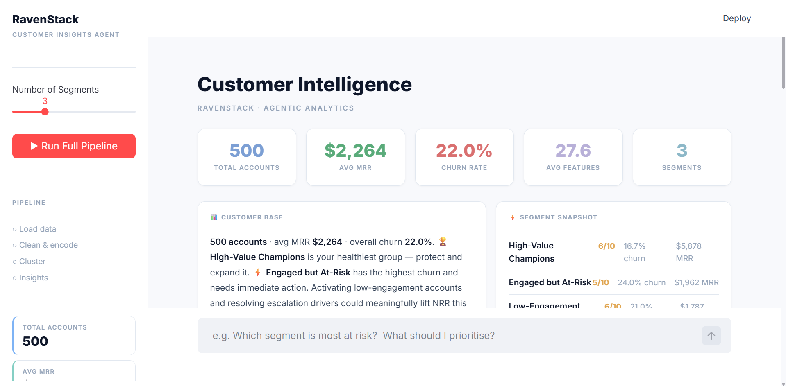
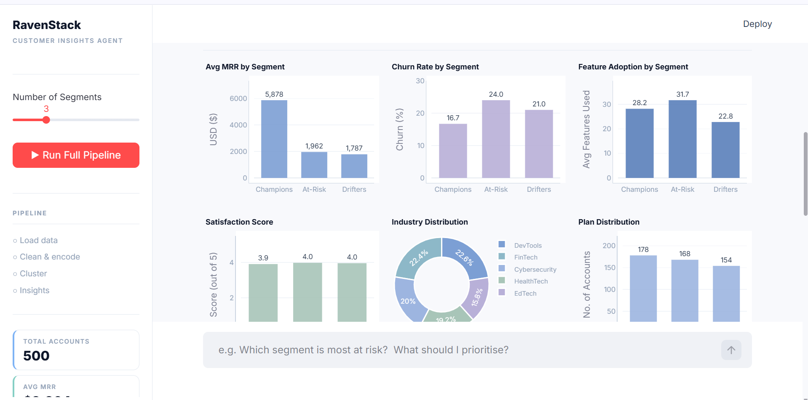

# 🤖 RavenStack Customer Insights Agent

An **agentic AI + data analytics** system that automatically loads, cleans, clusters, and generates actionable business insights from SaaS customer data — no API key required.

Built with Python, Streamlit, KMeans clustering, LangGraph, and Plotly.

---

## 📸 Dashboard Preview




---

## 🚀 What It Does

Most SaaS companies have customer data spread across subscriptions, feature usage, support tickets, and churn events. Manually analyzing all of that to understand who's at risk, who's healthy, and what to do about it takes days.

This agent does it in seconds.

- **Loads** 5 data sources and merges them into a single master customer view
- **Cleans** and encodes all features — nulls, categoricals, scaling
- **Clusters** customers into meaningful segments using KMeans with automatic optimal-k selection
- **Generates** health scores, risks, opportunities, and recommended actions per segment
- **Visualizes** everything in an interactive Streamlit dashboard with Plotly charts
- **Answers** natural language questions about your customer base via a chat interface

---

## 🧠 Agentic Architecture (LangGraph)

```
User Query
    ↓
🧠 Planner Node       → decides which steps to run
    ↓
📦 Load Data Node     → merges 5 CSVs into master dataframe
    ↓
🧹 Clean Data Node    → encodes, scales, fills nulls
    ↓
🤖 Cluster Node       → KMeans with silhouette scoring
    ↓
💡 Insights Node      → health scores, risks, actions
    ↓
✍️  Responder Node    → formats final answer
```

---

## 📊 Dashboard Sections

| Section | Description |
|---|---|
| **KPI Strip** | 5 top-level metrics at a glance |
| **Customer Base** | Narrative summary of the full dataset |
| **Segment Snapshot** | Side-by-side comparison of all segments |
| **Segment Cards** | Health score + churn rate per segment |
| **Analytics Overview** | 6 Plotly charts — MRR, churn, features, satisfaction, industry, plans |
| **Deep Dive Tabs** | Full breakdown per segment with profile, risks, opportunities, actions |
| **Ask the Agent** | Natural language chat interface |

---

## 🗂️ Dataset

Uses the **RavenStack** synthetic SaaS dataset — 5 CSV files:

| File | Rows | Description |
|---|---|---|
| `ravenstack_accounts.csv` | 500 | Company info, industry, plan tier |
| `ravenstack_subscriptions.csv` | 5,000 | MRR, ARR, upgrades, billing |
| `ravenstack_feature_usage.csv` | 25,000 | Feature-level usage and errors |
| `ravenstack_support_tickets.csv` | 2,000 | Tickets, resolution time, satisfaction |
| `ravenstack_churn_events.csv` | 600 | Churn dates, reasons, refunds |

---

## 🛠️ Tech Stack

| Layer | Tool |
|---|---|
| **UI** | Streamlit |
| **Charts** | Plotly |
| **Data** | Pandas |
| **ML / Clustering** | Scikit-learn (KMeans) |
| **Agentic Pipeline** | LangGraph |
| **AI Insights** | Anthropic Claude API *(optional)* |

---

## 📁 Project Structure

```
customer_saas_analytics/
├── app.py                  # Streamlit dashboard
├── data_loader.py          # Merges 5 CSVs → master dataframe
├── cleaner.py              # Encodes, scales, fills nulls
├── clustering.py           # KMeans + auto-k selection
├── insight_generator.py    # Claude API segment analysis (optional)
├── orchestrator.py         # LangGraph agentic pipeline
├── state.py                # Shared agent state schema
├── requirements.txt
├── README.md
├── .gitignore
├── .streamlit/
│   └── config.toml
└── data/
    ├── ravenstack_accounts.csv
    ├── ravenstack_subscriptions.csv
    ├── ravenstack_feature_usage.csv
    ├── ravenstack_support_tickets.csv
    └── ravenstack_churn_events.csv
```

---

## ⚙️ Setup & Run

### 1. Clone the repo
```bash
git clone https://github.com/YOUR_USERNAME/customer_saas_analytics.git
cd customer_saas_analytics
```

### 2. Install dependencies
```bash
pip install -r requirements.txt
```

### 3. Run the app
```bash
# Without Claude API — fully functional, data-driven insights
python -m streamlit run app.py

# With Claude API — AI-powered insights + live chat
set ANTHROPIC_API_KEY=your_key_here      # Windows
export ANTHROPIC_API_KEY=your_key_here   # Mac/Linux
python -m streamlit run app.py
```

---

## 💬 Example Chat Questions

Once the pipeline runs, try asking:

- *"Which segment is most at risk?"*
- *"What should I prioritise this quarter?"*
- *"Show me revenue by segment"*
- *"Which segment has the best feature adoption?"*
- *"What are the upsell opportunities?"*
- *"Give me recommended actions for each segment"*

---

## 🔑 Claude API (Optional)

The app works fully **without an API key** — all clustering, health scores, charts, and insights run locally for free.

Adding an Anthropic API key enables:
- Claude-powered segment names and narratives
- Live chat answers with full data context
- LangGraph orchestrator with AI planning

Get a key at [console.anthropic.com](https://console.anthropic.com)

---

## 📈 What I Learned

- Building end-to-end **agentic AI pipelines** with LangGraph
- **Customer segmentation** using KMeans with silhouette scoring
- Connecting **data analytics + generative AI** for business insights
- Building production-grade **Streamlit dashboards** with Plotly
- Designing **multi-source data pipelines** with Pandas

---

